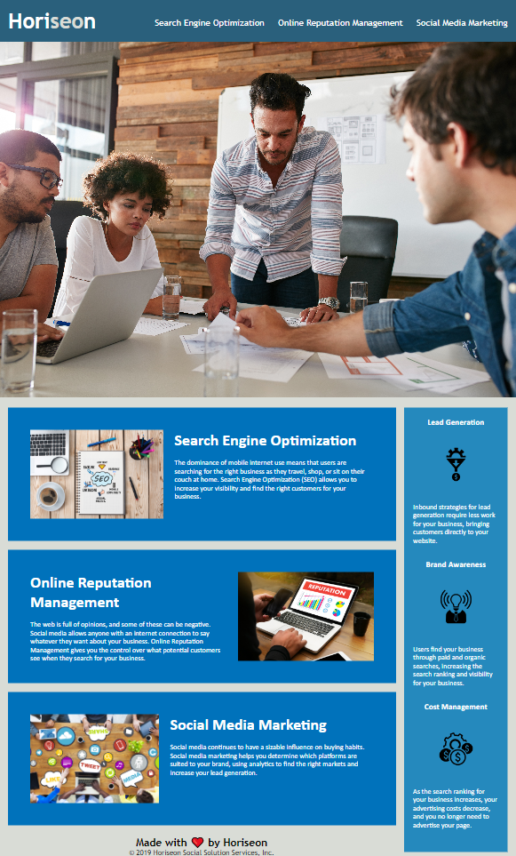

# Horiseon - Homepage 

## 01 HTML, CSS, and Git: Code Refactor

In this project, I was given a starter code that needs refactoring. The guidelines given were to make it follow accessibility standards, clean it up, and improve it for better sustainability for future updates while maintaining the integrity of the webpage. 

I want my code and supporting comments to demonstrate an understanding of the topics discussed such as the importance of semantic elements, use of tags and their attributes, use of CSS selectors, and layout based CSS declarations like: display, positioning, and box-model. 

The use of semantic tags and alt text for images follow web accessibility standards, allowing for use of assistive devices. These help the browser understand what the content is and how it may relate to others on the page, while container elements only show layout. Here, I have added `<header> <nav> <figure> <main> <aside> <footer>`, and *alt="description"* for `` tags. 

This project has really helped me with computational thinking, specifically decomposition and pattern recognition, when used to analyse html and css documents. It was helpful mentally breaking down the sections and tying them together to understand their interactions with each other and on the page. Reading the pre-written code also helped me understand the patterns that code may carry, and how to condense them as necessary to make it more readable and less overwhelming. This project also really helped me understand the importance of CSS layout declarations in terms of positioning elements on a page and their interactions with other page elements. I learned the importance of placement of code in HTML as moving things a line or two have an impact on how they show on a deployed page. I also learned to troubleshoot some issues I had, such as deployment issues where my webpage wouldn't load correctly, and realised that GitHub Pages was case-sensitive, so my CSS links and images weren't displaying properly until I fixed their pathways. However, it did demonstrate that my img alt attributes were working!

## Table of Contents

- [Deployment](#deployment)
- [Requirements](#requirements)
- [Usage](#usage)
- [Citations](#citations)
- [License](#license)

## Deployment

Link to my Horiseon -Homepage: 

**https://jaychan0125.github.io/Horiseon/**

## Requirements

Here are the User Story and Acceptance Criteria provided: 
> ### User Story
>AS A marketing agency 
>I WANT a codebase that follows accessibility standards 
>SO THAT our own site is optimized for search engines 
>
> ### Acceptance Criteria
>GIVEN a webpage meets accessibility standards 
>WHEN I view the source code 
>THEN I find semantic HTML elements 
>WHEN I view the structure of the HTML elements 
>THEN I find that the elements follow a logical structure independent of styling and positioning 
>WHEN I view the icon and image elements 
>THEN I find accessible alt attributes 
>WHEN I view the heading attributes 
>THEN they fall in sequential order 
>WHEN I view the title element 
>THEN I find a concise, descriptive title 

With additional grading requirements including:
>Application's links all function correctly. 
>Application's CSS selectors and properties are consolidated and organized to follow semantic structure. 
>Application's CSS file is properly commented. 
>Application deployed at live URL. 

## Usage

The Navigation Bar on the top right has three different buttons that will link you further down the page to the associated sections. 

## Citations

Maqsood, A., Moatar, T., Krishna, &amp; Zhang, S. (2023). Html, Css, and Git Day 1-3. Lecture. 

## License

Licensed under the MIT license.

---
